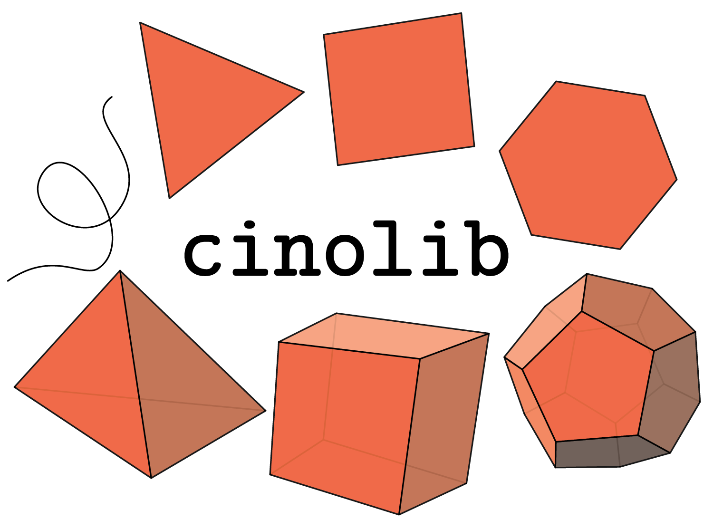

# cinolib
A generic programming header only C++ library for processing polygonal and polyhedral meshes.

<p align="center"></p>

(info on how to install/use it coming soon!)


## Acknowldegment
If you use cinolib in your academic projects, please cite the library using the following 
BibTeX entry:

```bibtex
@misc{cinolib,
  title  = {{cinolib}: a generic programming header only {C++} library for processing polygonal and polyhedral meshes.},
  author = {Marco Livesu},
  note   = {https://github.com/maxicino/cinolib/},
  year   = {2017},
}
```
