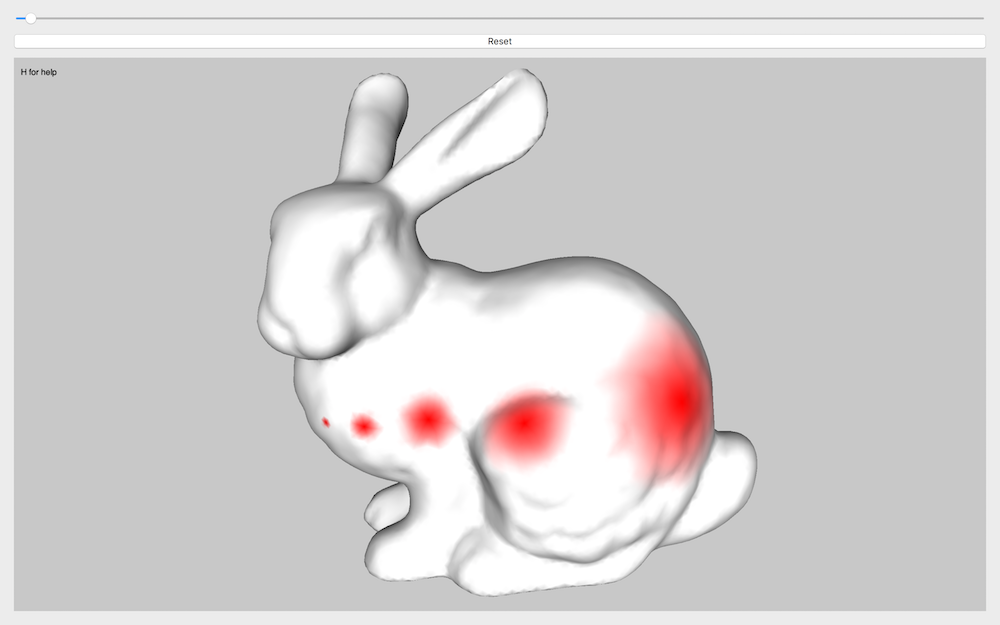
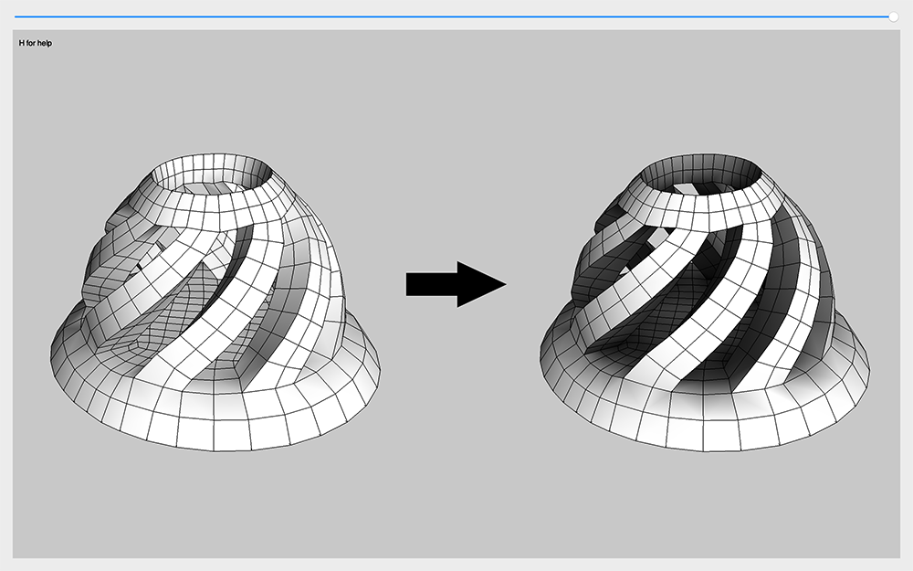
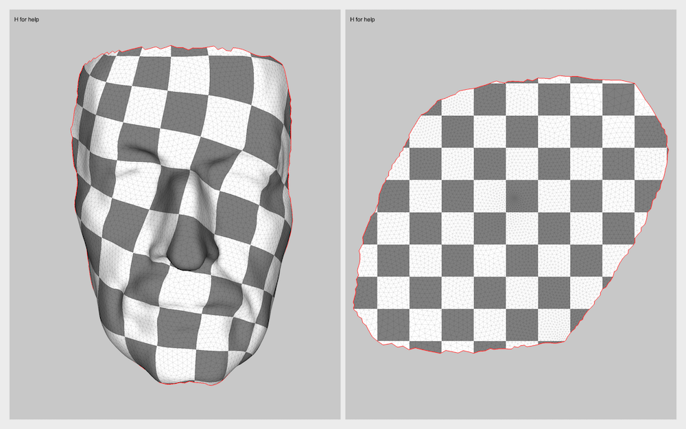
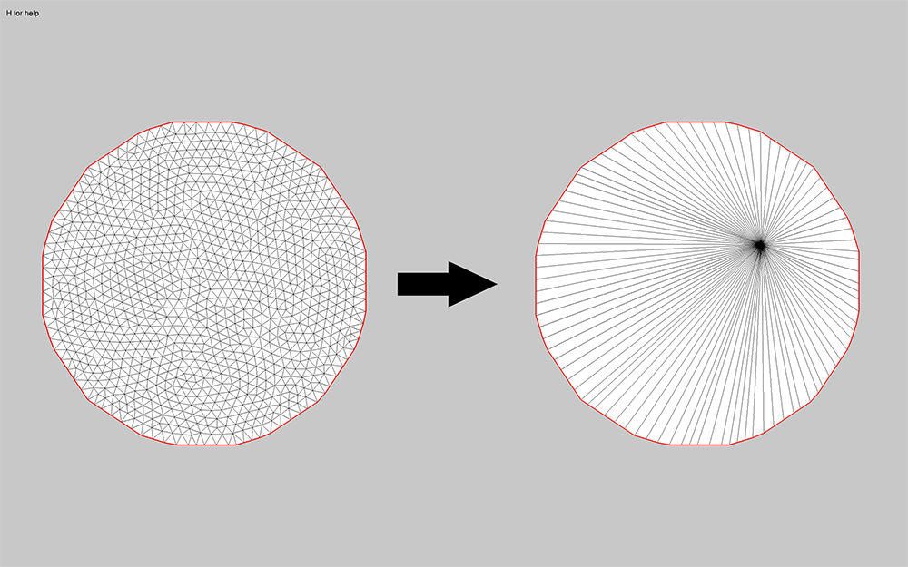
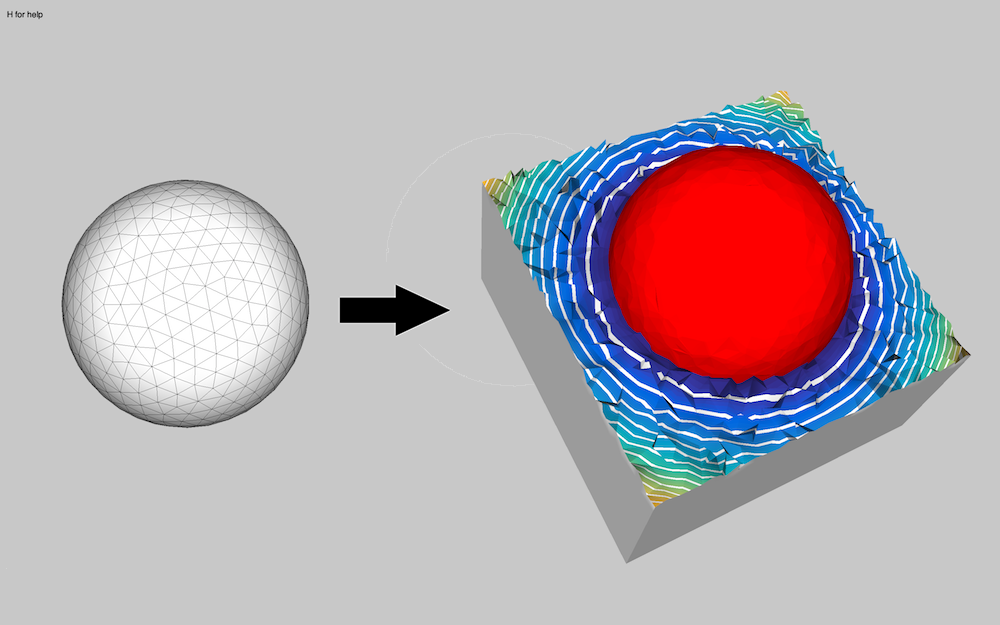
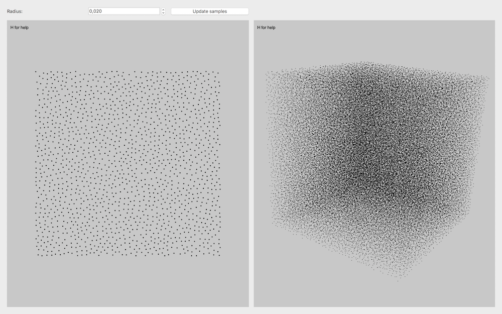
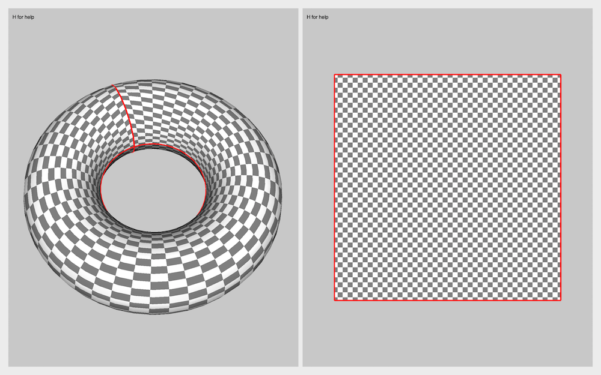

# Examples
This folder contains a number of sample programs that illustrate the core functionalities of CinoLib.

### How to compile the example projects
To compile the examples you must download CinoLib on your machine and install [Qt](https://www.qt.io) for the GUI. You can compile all the examples together by considering the file `build_all_examples.pro`, or compile a specific example by considering its project file (.pro). Project files can be compiled either with [QtCreator](https://www.qt.io/qt-features-libraries-apis-tools-and-ide/) or by opening a terminal in the same folder and typing
```
qmake .
make -j4
```

### External dependencies
Some of the projects depend from external libraries which are not included in CinoLib (e.g. [Triangle](https://www.cs.cmu.edu/~quake/triangle.html), [Tetgen](http://wias-berlin.de/software/index.jsp?id=TetGen&lang=1) or [VTK](https://www.vtk.org)). These libraries should be installed separately, and the project files updated with correct paths for compiler and linker. Projects with external dependencies are marked in `build_all_examples.pro`. If you are not interested in these examples, you can safely comment them by adding `#` at the beginning of the corresponding lines in the project file, and they will be automatically ignored by qmake.

# List of Examples
Here is a list of the sample programs available in CinoLib.

#### 01 - Load and render a triangle mesh
[<p align="left"></p>](https://github.com/mlivesu/cinolib/blob/master/examples/01_base_app_trimesh)

#### 02 - Load and render a quadrilateral mesh
[<p align="left"></p>](https://github.com/mlivesu/cinolib/blob/master/examples/02_base_app_quadmesh)

#### 03 - Load and render a general polygonal mesh
[<p align="left"></p>](https://github.com/mlivesu/cinolib/blob/master/examples/03_base_app_polygonmesh)

#### 04 - Load and render a tetrahedral mesh
[<p align="left"></p>](https://github.com/mlivesu/cinolib/blob/master/examples/04_base_app_tetmesh)

#### 05 - Load and render a hexahedral mesh
[<p align="left"></p>](https://github.com/mlivesu/cinolib/tree/master/examples/05_base_app_hexmesh)

#### 06 - Load and render a general polyhedral mesh
[<p align="left"></p>](https://github.com/mlivesu/cinolib/tree/master/examples/06_base_app_polyhedralmesh)

#### 07 - Load and render a textured object in OBJ format
[<p align="left"></p>](https://github.com/mlivesu/cinolib/tree/master/examples/07_textured_OBJs)

#### 08 - Do vertex picking for interactive applications
[<p align="left"></p>](https://github.com/mlivesu/cinolib/tree/master/examples/08_picking)

#### 09 - Compute n-harmonic functions on discrete surfaces
[<p align="left"></p>](https://github.com/mlivesu/cinolib/tree/master/examples/09_polyharmonic_functions_srf)

#### 10 - Compute n-harmonic functions on discrete volumes
[<p align="left"></p>](https://github.com/mlivesu/cinolib/tree/master/examples/10_polyharmonic_functions_vol)

#### 11 - Map a genus zero object to a sphere using conformalized mean curvature flow
[<p align="left"></p>](https://github.com/mlivesu/cinolib/tree/master/examples/11_map_to_sphere)

#### 12 - Generate triangular and polygonal tessellations of 2D domains
[<p align="left"></p>](https://github.com/mlivesu/cinolib/tree/master/examples/12_polygon_mesh_generation)

#### 13 - Generate tetrahedral and polyhedral tessellations of 3D domains
[<p align="left"></p>](https://github.com/mlivesu/cinolib/tree/master/examples/13_polyhedral_mesh_generation)

#### 14 - Compute geodesic distances using the heat flow method
[<p align="left"></p>](https://github.com/mlivesu/cinolib/tree/master/examples/14_heat_based_geodesics)

#### 15 - Compute kernels, incircles and circumcircles of 2D polygons
[<p align="left"></p>](https://github.com/mlivesu/cinolib/tree/master/examples/15_polygon_measures)

#### 16 - Use spherical Fibonacci to evenly sample the unit sphere
[<p align="left"></p>](https://github.com/mlivesu/cinolib/tree/master/examples/16_sphere_sampling)

#### 17 - Extract (and tessellate) ISO contours on surface meshes
[<p align="left"></p>](https://github.com/mlivesu/cinolib/tree/master/examples/17_iso_contours)

#### 18 - Extract  (and tessellate) ISO surfaces on tetrahedral meshes
[<p align="left"></p>](https://github.com/mlivesu/cinolib/tree/master/examples/18_iso_surfaces)

#### 19 - Compute discrete harmonic maps
[<p align="left"></p>](https://github.com/mlivesu/cinolib/tree/master/examples/19_harmonic_map)

#### 20 - Compute coarse layouts of quadrilateral meshes
[<p align="left"></p>](https://github.com/mlivesu/cinolib/tree/master/examples/20_coarse_quad_layouts)

#### 21 - Compute coarse layouts of hexahedral meshes
[<p align="left"></p>](https://github.com/mlivesu/cinolib/tree/master/examples/21_coarse_hex_layouts)

#### 22 - Remesh, preserving sharp creases and/or color patches
[<p align="left"></p>](https://github.com/mlivesu/cinolib/tree/master/examples/22_remesher)

#### 23 - Find, adjust, and export sharp creases from a mesh
[<p align="left"></p>](https://github.com/mlivesu/cinolib/tree/master/examples/23_sharp_creases)

#### 24 - Read and visualize a sliced object for 3D printing
[<p align="left"></p>](https://github.com/mlivesu/cinolib/tree/master/examples/24_sliced_obj)

#### 25 - Paint on a 3D surface using brushes of different sizes
[<p align="left"></p>](https://github.com/mlivesu/cinolib/tree/master/examples/25_surface_painter)

#### 26 - Export the skin of a volumetric mesh to a surface mesh (command line tool)

#### 27 - Update the skin of a volumetric mesh from a surface mesh (command line tool)

#### 28 - Wrap tetgen to tetrahedralize a PLC in any file format supported by cinolib (command line tool)

#### 29 - Use ambient occlusion for realistic yet more revealing snapshots
[<p align="left"></p>](https://github.com/mlivesu/cinolib/tree/master/examples/29_ambient_occlusion)

#### 30 - Convert all supported meshes from one file format to another (command line tool)

#### 31 - Compute a Least Squares Conformal Map (LSCM)
[<p align="left"></p>](https://github.com/mlivesu/cinolib/tree/master/examples/31_LSCM)

#### 32 - Compute a homotopy basis using the tree-cotree algorithm
[<p align="left"></p>](https://github.com/mlivesu/cinolib/tree/master/examples/32_homotopy_basis)

#### 33 - Progressively collapse all internal edges of a triangle mesh
[<p align="left"></p>](https://github.com/mlivesu/cinolib/tree/master/examples/33_edge_collapse)

#### 34 - Interpolate an oriented point cloud with Hermite RBF
[<p align="left"></p>](https://github.com/mlivesu/cinolib/tree/master/examples/34_Hermite_RBF)

#### 35 - Perform Poisson disk sampling in any dimension
[<p align="left"></p>](https://github.com/mlivesu/cinolib/tree/master/examples/35_Poisson_sampling)

#### 36 - Compute a canonical polygonal schema
[<p align="left"></p>](https://github.com/mlivesu/cinolib/tree/master/examples/36_canonical_polygonal_schema)

# Upcoming examples
Maintaining a library alone is very time consuming, and the amount of time I can spend on CinoLib is limited. I do my best to keep the number of examples constantly growing. I am currently working on various code samples that showcase other core functionalities of CinoLib. All (but not only) these topics will be covered:

* Copy/paste points of view from the GL canvas for accurate visual comparisons and fast snapshot reproduction
* Customize data structures with user defined mesh/vertex/edge/polygon/polyhedron attributes
* Navigate application history exploiting Cinolib undo/redo facilities
* Generate, process and visualize scalar fields
* Generate, process and visualize vector fields
* Topology editing operators for tetrahedral meshes
* Topology editing operators for general polygonal meshes
* Topology editing operators for general polyhedral meshes
* Subdivision schemas for hexahedral meshes
* Solve multi-labeling problems on surfaces and volumes using the [GraphCuts](http://vision.csd.uwo.ca/code/) wrapper
* Integral curve computation (and tessellation)
* Processing of 2D polygons (booleans, thickening), using the [Boost Polygon Library](https://www.boost.org/doc/libs/1_67_0/libs/polygon/doc/index.htm) wrapper
* Compute the Medial Axis Transform (MAT) and Scale Axis Transform (SAT) of binary images using [Qgarlib](https://raweb.inria.fr/rapportsactivite/RA2008/qgar/uid18.html)
