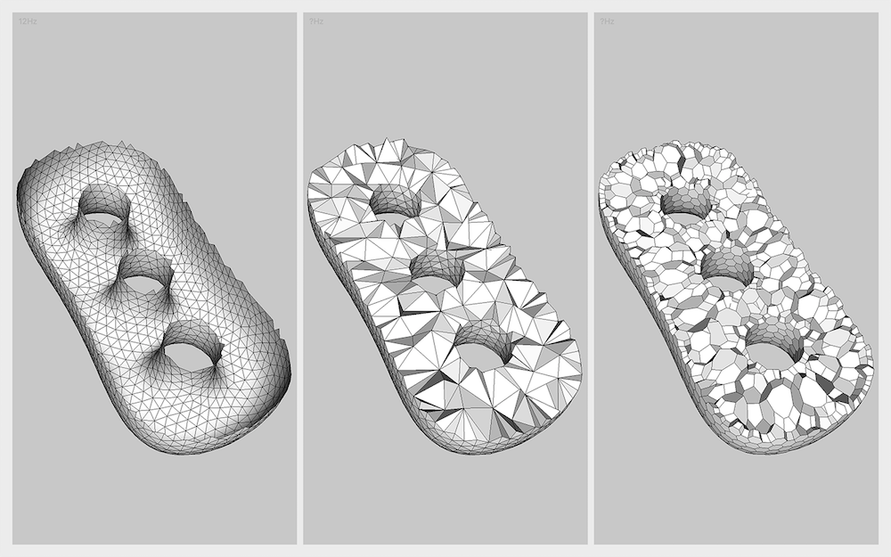
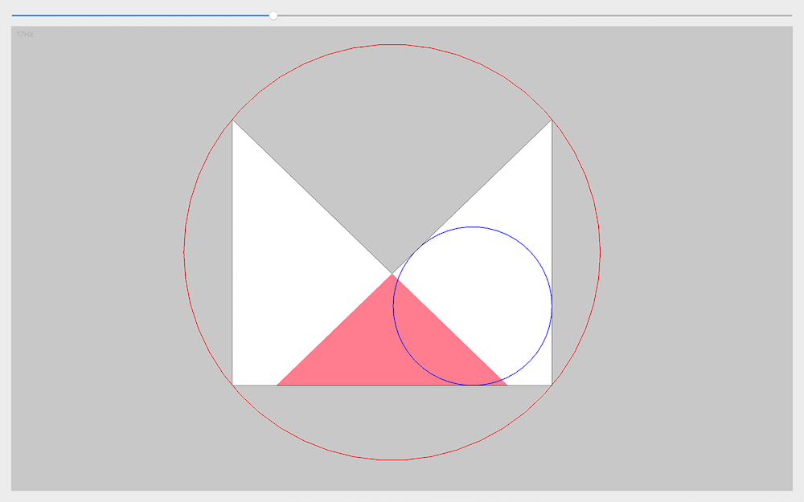

# Examples
This folder contains a number of sample programs that illustrate the core functionalities of CinoLib. 

### How to compile the example projects
To compile the examples you must download CinoLib and [Eigen](http://eigen.tuxfamily.org) on your machine, and install [Qt](https://www.qt.io) and [libQGLViewer](http://libqglviewer.com/index.html) for the GUI. Each sample project comes with its own configuration file (.pro), in which links to the aforementioned libraries are specified. Alternatively, you can compile all the examples together by considering the file `build_all_examples.pro`. Configuration files require minimal editing prior compilation. Specifically, you need to:

* change the path `/usr/local/include/eigen3` with the local path to your Eigen headers
* change the path `/Library/Frameworks/QGLViewer.framework/Versions/2/Headers` with the local path to your QGLViewer headers
* change the `.` in `-L. -lQGLViewer` with your local path to the QGLViewer library

Once you do it, you can open your terminal on the selected examples folder, and type
```
qmake .
make -j4
```

### Additional dependencies
Notice that some of the projects also depend from external libraries which are wrapped in CinoLib (e.g. [Triangle](https://www.cs.cmu.edu/~quake/triangle.html), [Tetgen](http://wias-berlin.de/software/index.jsp?id=TetGen&lang=1) or [VTK](https://www.vtk.org)). In this case, such libraries should be installed separately, and the configuration files updated with correct paths for compiler and linker. If you are not interested in these examples, you can safely comment them by adding `#` at the beginning of the corresponding lines in `build_all_examples.pro`, and they will be automatically ignored by qmake.

# List of Examples
Here is a list of the sample programs available in CinoLib.

#### 01 - Load and render a triangle mesh
<p align="left"></p>

#### 02 - Load and render a quadrilateral mesh
<p align="left"></p>

#### 03 - Load and render a general polygonal mesh
<p align="left"></p>

#### 04 - Load and render a tetrahedral mesh
<p align="left"></p>

#### 05 - Load and render a hexahedral mesh
<p align="left"></p>

#### 06 - Load and render a general polyhedral mesh
<p align="left"></p>

#### 07 - Load and render a textured object in OBJ format
<p align="left"></p>

#### 08 - Compute polyharmonic functions on discrete surfaces
<p align="left"></p>

#### 09 - Compute polyharmonic functions on discrete volumes
<p align="left"></p>

#### 10 - Map a closed object to a sphere using conformalized mean curvature flow
<p align="left"></p>

#### 11 - Generate triangular and polygonal tessellations of 2D domains
<p align="left"></p>

#### 12 - Generate tetrahedral and polyhedral tessellations of 3D domains
<p align="left"></p>

#### 13 - Compute geodesic distances using the heat flow method
<p align="left"></p>

#### 14 - Compute kernels, incircles and circumcircles of 2D polygons
<p align="left"></p>

#### 15 - Use spherical Fibonacci to evenly sample the unit sphere
<p align="left"></p>

#### 16 - Extract ISO surfaces using marching cubes for tetrahedral meshes
<p align="left"></p>

# Upcoming examples
Maintaining a library alone is very time consuming, and the amount of time I can spend on CinoLib is limited. I do my best to keep the number of examples constantly growing. I am currently working on various code samples that showcase other core functionalities of CinoLib. All (but not only) these topics will be covered:

* Copy/paste points of view from the GL canvas for accurate visual comparisons and fast snapshot reproduction
* Customize data structures with user defined mesh/vertex/edge/polygon/polyhedron attributes
* Generate, process and visualize scalar fields
* Generate, process and visualize vector fields
* Overview of the topology editing operators implemented in CinoLib
* Evaluation of mapping distortions (angle/areas distortion popular metrics)
* Computation of conformal maps for surface meshes
* Parameterization based hexahedral remeshing
* Surface and volumetric format converters
* Solve multi-labeling problems on surfaces and volumes using the [GraphCuts](http://vision.csd.uwo.ca/code/) wrapper
* Integral curve computation (and tessellation)
* Iso curve computation (and tessellation)
* Subdivision schemas for hexahedral meshes
